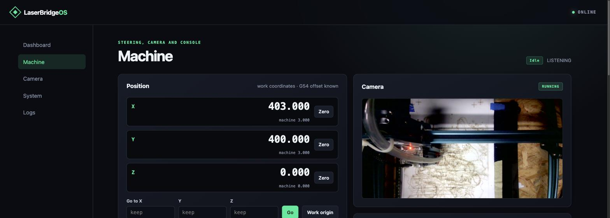
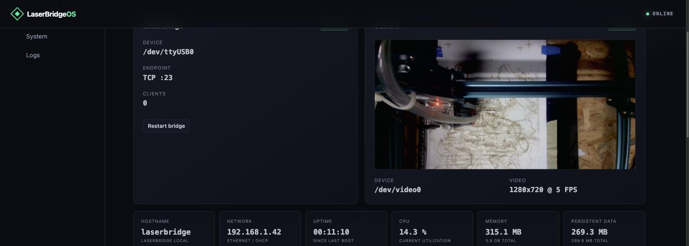
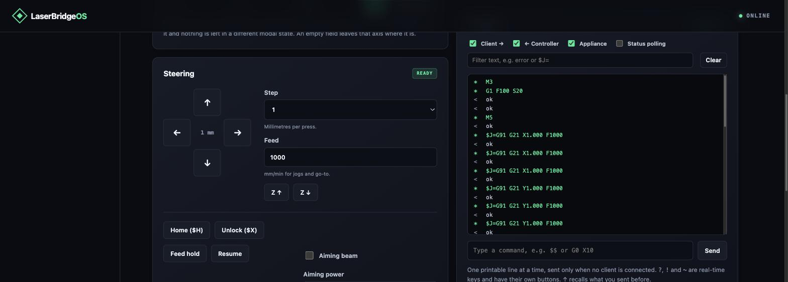
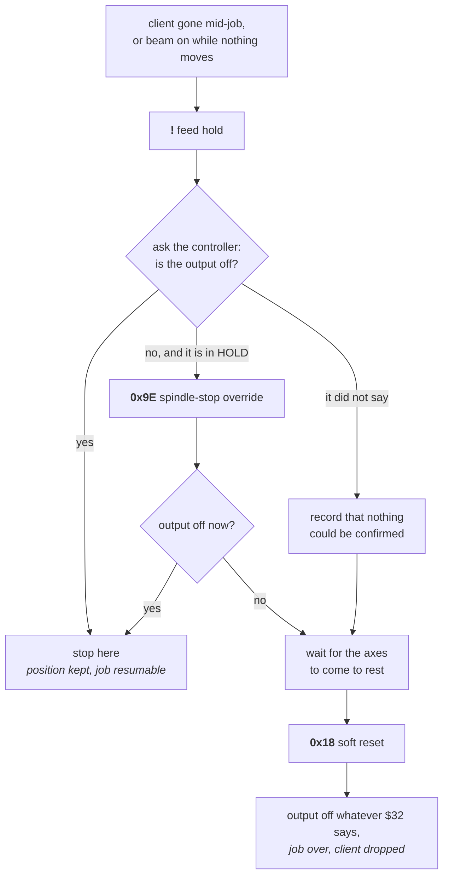
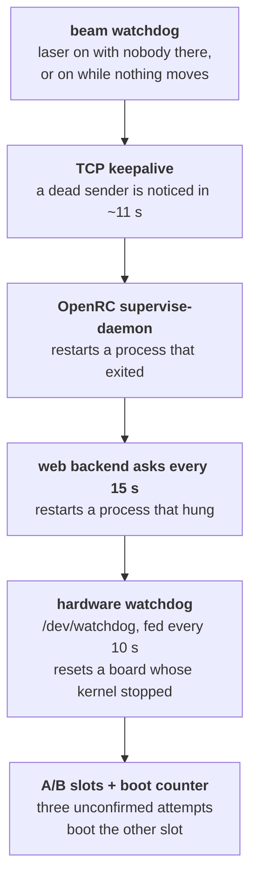
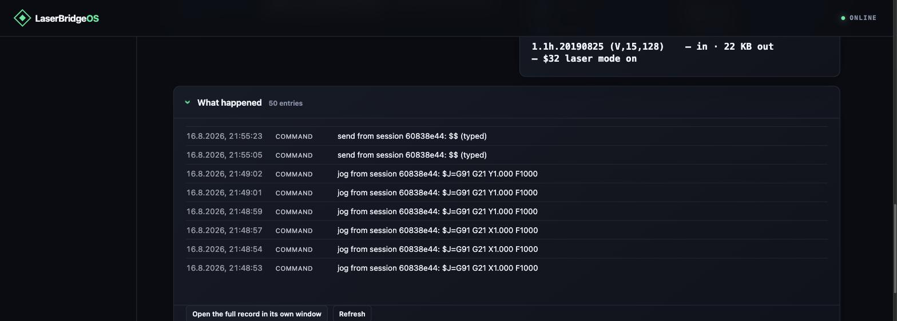
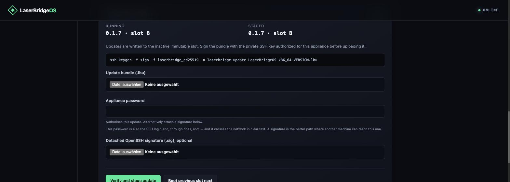

# LaserBridgeOS — user guide

LaserBridgeOS turns a small headless PC into an appliance that sits beside a
GRBL laser cutter, holds its USB serial port, and offers it on the local
network. LightBurn connects over Wi-Fi or Ethernet and cuts as if it were
plugged in — and while it does, the appliance reads along with the conversation
it is carrying and acts when the machine is left in a state nobody would leave
it in on purpose.



> **This is not an emergency stop and will never be one.** Everything on this
> page needs the appliance running, the network up, the cable seated and the
> controller answering. Keep using the red mushroom button on the machine. What
> follows is a second line of defence, for the failures nobody is standing next
> to.

---

## Contents

1. [Is this for you?](#is-this-for-you)
2. [What you need](#what-you-need)
3. [Installing](#installing)
4. [First boot](#first-boot)
5. [Connecting LightBurn](#connecting-lightburn)
6. [The Machine page](#the-machine-page)
7. [Steering the machine yourself](#steering-the-machine-yourself)
8. [The console](#the-console)
9. [What the appliance does on its own](#what-the-appliance-does-on-its-own)
10. [Keeping itself alive](#keeping-itself-alive)
11. [Reading the record](#reading-the-record)
12. [Updating and rolling back](#updating-and-rolling-back)
13. [Troubleshooting](#troubleshooting)
14. [Where things are](#where-things-are)

---

## Is this for you?

Yes, if you have a **GRBL 1.1 laser with a USB port** — a SCULPFUN, an Ortur, a
diode engraver, an older CNC-style controller — and you would rather not keep a
computer standing next to it.

Putting a serial port on the network is not hard; `ser2net` does it in four
lines, and this appliance still ships it as a fallback. What is hard is
everything that follows. A USB cable fails in one way: it comes out and the job
stops. A network link fails in ways that look nothing like that — Wi-Fi drops
while the planner buffer still holds thirty seconds of work, a laptop suspends
with its TCP connection technically alive, the sender hangs while the socket
stays open. In every one of those cases the stream stops, and on a laser in
`M3` constant-power mode a stream that stops leaves the beam **on** at its last
setting while the machine stands still.

A dumb forwarder cannot help with that, because it does not know what it is
carrying. This one does.

**Not for you** if your machine has a Ruida, Trocen or another proprietary DSP
controller — the appliance would carry the bytes but understand none of them,
and everything below depends on understanding them.

---

## What you need

| | |
| --- | --- |
| **Computer** | Any x86_64 machine that boots UEFI: mini PC, thin client, retired office box. 512 MB RAM minimum, 1 GB comfortable. A 2 GB disk is enough. |
| **Network** | Ethernet is the easy path. Wi-Fi works, and setup needs an adapter whose Linux driver can act as an access point. |
| **Controller** | GRBL 1.1 over USB serial, appearing as `/dev/ttyUSB*` or `/dev/ttyACM*`. |
| **Camera** | Optional. Any UVC/V4L2 webcam; MJPEG is preferred. |

ARM boards — Raspberry Pi and friends — are not supported by the current image.

---

## Installing

Download the image from the [releases
page](https://github.com/hkiam/LaserBridgeOS/releases), or build it yourself
with `make image`. Then write it to the appliance's disk:

```sh
gunzip -c LaserBridgeOS-x86_64.img.gz | sudo dd of=/dev/sdX bs=4M status=progress conv=fsync
```

`/dev/sdX` is the appliance's **whole disk**, not a partition. Everything on it
is overwritten.

You can also try it without installing anything: the repository has a
`deploy-and-test` workflow that boots the image over the network into RAM,
leaving the target's own disk untouched. See the README for that path.

---

## First boot

1. Boot the target in **UEFI mode**. There is no boot menu and no login prompt —
   it is an appliance.
2. **With Ethernet attached**, open `http://laserbridge.local`.
   **Without**, join the `LaserBridge-XXXXXX` Wi-Fi network using the password
   `laserbridge-setup` and open `http://10.42.0.1`.
3. The setup wizard asks for a hostname, the Wi-Fi network to join, and how you
   want SSH access: a password, a freshly generated key to download, or your own
   public key.
4. Finish. The setup hotspot shuts down, the appliance joins your network, and
   it is reachable at `http://<hostname>.local`.

> **macOS and iOS** open a small captive-portal window when you join the setup
> hotspot. It runs the wizard fine but cannot save downloads, so the generated
> key appears not to arrive. The wizard therefore also shows the key as
> selectable text — or open `http://10.42.0.1` in a real browser.

The dashboard is the first thing you see afterwards:



---

## Connecting LightBurn

1. Add a **GRBL** device in LightBurn.
2. Choose its network connection rather than a USB serial port.
3. Host `laserbridge.local`, port `23`. If mDNS does not resolve on your
   network, use the IP address from the dashboard.
4. Make sure nothing else is holding the connection, and connect.

The endpoint is **raw TCP** — not Telnet, not RFC2217. It carries the GRBL
serial protocol byte for byte at the configured baud rate.

Only one client is served at a time, on purpose: two applications on one laser
is the failure this appliance exists to prevent. If you would rather have a new
connection take over from a stale one, switch on *Kick old client on new
connection* in the bridge settings.

**Two settings on your controller are worth checking**, and the appliance shows
both on the Machine page:

- **`$32` (laser mode) should be 1.** With `$32=1` a feed hold switches the beam
  off. With `$32=0` GRBL treats the laser as a spindle, and a feed hold
  deliberately leaves a spindle running — the appliance knows the difference and
  reaches for a soft reset instead, but the first rung of its ladder is gone.
- **`$30` (maximum spindle speed)** is what a percentage of laser power is a
  percentage of. The appliance reads it rather than assuming GRBL's default.

---

## The Machine page

Everything about operating the machine is on one page, because standing at a
laser you hold four questions at once: where is the head, what is it doing, what
does the camera see, and what did it just say.


**The readout** shows work coordinates large, machine coordinates small
underneath. Work coordinates are the ones you set a zero in and the ones a
go-to target is typed in; machine coordinates are what the limits and the record
are in. GRBL sends one of the two and the offset between them — the appliance
remembers the offset and derives the other.

**Zero** sets the work origin for that axis, here, with `G10 L20 P1`. It is the
one command on this page that outlives the session: it is written to the
controller's EEPROM and survives a power cycle.

**The camera** sits beside the readout so the machine can be watched from the
same page it is steered from.

---

## Steering the machine yourself



Nothing here works while a sender is connected. That is deliberate and it is
enforced in the daemon, not in the page: two applications steering one laser is
exactly what this appliance exists to prevent. The one exception is **Stop**,
because it ends the conflict rather than joining it — it takes the machine over,
tells the connected client so, and drops it.

| Control | What it sends | Notes |
| --- | --- | --- |
| **Jog pad** | `$J=G91 G21 X10.000 F1000` | Relative, millimetres, restated every time — a jog that inherited `G20` from an earlier job would move 25× too far. |
| **Step / Feed** | — | Millimetres per press, and the feed used for jogs and go-to. |
| **Go to** | `$J=G90 G21 X… Y… F…` | Absolute, in the coordinate system the readout shows. An empty field leaves that axis where it is. |
| **Cancel jog** | `0x85` | Empties the jog queue without touching anything else. Appears while the machine is moving. |
| **Home / Unlock** | `$H` / `$X` | Homing is only offered where `$22` says there is a homing cycle. |
| **Feed hold / Resume** | `!` / `~` | Real-time; acted on the moment the controller reads them. |
| **Aiming beam** | `M3` then `G1 F100 S…` | See below. |
| **Stop** | `0x18` soft reset | Output off whatever `$32` says, job over, client dropped. **Not an emergency stop.** |

### The aiming beam is held, not switched on

A low-power dot for lining work up. Two things about it are worth knowing.

**It takes two lines.** `M3` alone does not light a laser in laser mode: GRBL
applies a block's programmed power only if that block's modal motion is `G1`,
`G2` or `G3`, and after a reset the modal motion is `G0`. So the appliance sends
what a sender's fire button sends — `M3`, then `G1 F100 S20` with no axis words.
Nothing moves; the `G1` is there to put the parser where the power can reach the
output.

**It is a dead man's handle.** The browser holds a three-second lease and renews
it every second. While it is held, the beam counts as attended and the beam
watchdog leaves it alone. When it lapses — a closed laptop, a dropped Wi-Fi
link, a tab that crashed — the beam goes out on its own. Only one browser
session may hold it; a second is refused rather than allowed to take over
somebody else's beam mid-alignment.

### The machine takes time

A jog is answered when the controller *accepts* it, not when the move is
finished — that is what makes continuous jogging possible. The page says
"still moving" while the axes are running and offers **Cancel jog**, and the
appliance counts its own lines against GRBL's 128-byte receive buffer exactly as
it insists a sender does. Press faster than the machine answers and you get a
polite refusal rather than a corrupted stream.

---

## The console

The console shows the traffic the appliance is carrying, in both directions,
with three marks:

| Mark | Meaning |
| --- | --- |
| `>` | what the client sent to the controller |
| `<` | what the controller answered |
| `*` | what the appliance sent itself |

Filter by direction or by text — during a job the interesting line is one in
three hundred. **Status polling** is hidden by default: the appliance asks for a
status report every second whenever nobody else has, and without that filter the
transcript is two lines a second of `?` and `<Idle|MPos:…>`.

**Typing a command** sends one printable line, up to eighty characters, through
the same guards as everything else: only with the `laserbridged` backend, only
with no client connected, counted against the controller's buffer. `?`, `!` and
`~` are real-time keys and are refused there — they have buttons that account
for them properly. ↑ recalls what you sent before.

**It is only recorded while somebody is looking at it.** The transcript is
assembled in the code path that carries bytes between the sender and the
machine, and doing that during every job for nobody's benefit is not acceptable
on that path. A reader holds a lease that polling renews; close the tab and
recording stops within fifteen seconds. Four hundred lines are kept, and if you
fall behind you are told how many were lost rather than shown a transcript with
an invisible hole in it.

The same transcript is available over TCP for anyone who wants to log it —
set a **monitor port** in the bridge settings and connect with `nc`. That port
reads and discards whatever you type: a watcher must not be able to steer.

---

## What the appliance does on its own

This is the part a dumb forwarder cannot do, and it is deliberately narrow. The
appliance acts on exactly two situations.

### 1. The client disappears mid-job

A laptop closes its lid; Wi-Fi drops; LightBurn is killed. The controller keeps
working through its planner buffer with nobody watching. What happens next is
your choice:

| `on_disconnect` | Effect |
| --- | --- |
| `none` | Nothing. The machine finishes its buffer. |
| `hold` | A feed hold, then a check that the beam actually went off — and an escalation if it did not. Keeps the position. |
| `reset` *(default)* | A feed hold, then — once the machine reports it has stopped — a soft reset. The job ends and the output is off whatever the controller is configured like. |

A dead client is noticed in about eleven seconds: TCP keepalives are configured
at five seconds idle, three probes two seconds apart. Without them a vanished
laptop leaves a socket that never reports an error and a port claimed by a
machine that is not there.

### 2. The laser is on while nothing moves

A disconnect is a symptom; this is the hazard itself, and it has causes a
disconnect cannot see — a sender that hangs with its connection intact, for one.

| Condition | Grace |
| --- | --- |
| Laser on, nobody connected | 1 second |
| Laser on, machine has not moved | `stationary_beam_seconds`, 20 by default, 0 switches it off |

The second must be **longer than your longest pierce**, which is a stationary
burn on purpose.

### The ladder

Both situations end in the same escalation, and every rung is decided by what
the controller says about itself:



Three details that took a real machine to get right:

- **The evidence has a date on it.** GRBL mentions its outputs only alongside
  its `Ov:` block — every tenth report when idle, every twentieth while moving.
  So "off" can be a twenty-second-old sample taken at an instant when the output
  happened to be off. The page says *not conclusive* rather than *off* when a
  machine is cutting at non-zero power, and the stationary check declines to act
  on evidence that old — and records that it declined.
- **The spindle-stop override is a toggle** and acts only in HOLD. It is only
  ever sent on positive evidence that the output is on; sending it to a
  controller whose output is already off would switch the laser back on.
- **Whoever takes the machine takes it completely.** If a sender is still
  streaming when the appliance intervenes, it is told —
  `[MSG:LaserBridgeOS took over: …]`, which LightBurn prints in its console —
  and then dropped. A soft reset empties GRBL's buffers, and a sender that knows
  nothing about it keeps counting acknowledgements against a buffer that no
  longer holds what it thinks. That is not a failed job, it is a wrong cut.

### What it will not do

An idle machine is left alone. A service restart is not a client walking away,
so saving settings during a job does not pause it. And a job is only a job when
a client is connected — otherwise every tap on the jog pad would count as one.

---

## Keeping itself alive

The bridge supervises the machine, which makes its own failure the one that
matters most and the one thing it cannot notice about itself. Five layers, each
covering what the one below cannot see:



**The hardware watchdog** does not judge the system's health. It writes to
`/dev/watchdog` every ten seconds while it is being scheduled, and asks nothing
else — a false positive here costs a reboot in the middle of a cut. Stopping the
service writes the magic close character first, so a deliberate stop is not a
delayed reset. Boards without a watchdog device (most virtual machines) boot
with that one service failed and say so: an appliance without a last resort
should not look like one that has it.

Coming back through a reboot re-enumerates USB, which toggles DTR, which
soft-resets an Arduino-based controller — and a soft reset switches the output
off whatever `$32` says. The recovery path ends where the hazard does.

---

## Reading the record

Alarms, errors, and everything the appliance did on its own — with the G-code
line that caused it.



GRBL answers `error:9` and names no line number. But it answers **in order**,
exactly one `ok` or `error:` per line it accepted, so the line a reply refers to
is the oldest one not yet answered for. The appliance counts them and names it.
When it cannot be sure — a client that attached to a controller already working,
so the count never lined up — it says nothing rather than guessing, and still
shows the surrounding lines.

Two hundred events are kept in memory and the notable ones survive a reboot in
`/data/laserbridge/bridge-journal.log`. The file is read back when the bridge
starts, so an incident is still there after the restart it caused — which used
to be exactly when it disappeared.

Steering is recorded too. A record that says the machine moved without saying
who moved it answers the wrong question, so every command carries the browser
session that sent it.

The last few entries fold out on the Machine page; a button opens the whole
record in a window of its own, to leave open beside the machine.

---

## Updating and rolling back



The system lives in two immutable slots. An update is written to the one that is
not running, and only the last step points the next boot at it — so a bundle
that fails halfway leaves the appliance exactly as it was. `/data` is shared, so
your configuration, keys and record survive both directions.

**Authorise an update in one of two ways.** Enter the appliance password — the
simple path, and it crosses the network in clear text, where it is also the SSH
login. Or sign the bundle with an SSH key the appliance already trusts:

```sh
ssh-keygen -Y sign -f laserbridge_ed25519 -n laserbridge-update \
  LaserBridgeOS-x86_64-VERSION.lbu
```

Upload bundle and signature together. A signature proves the bundle came from
the key holder; a password only proves the uploader knew it.

**Rolling back** is one button: *Boot previous slot next*, then reboot. An older
slot reading a newer configuration file skips what it does not understand,
reports what it skipped, and leaves the file alone — so booting the newer slot
again finds its settings where it left them.

**If a slot does not boot at all**, GRUB counts attempts and selects the other
one after three unconfirmed tries. Userspace resets the counter once the default
runlevel is up.

Two things an update cannot do, and both are worth knowing before you plan one:

- **It cannot change how the appliance boots.** `grub.cfg` is embedded in the
  GRUB binary on the ESP, which no bundle touches. Kernel command line, boot
  counter, slot layout: image properties, not update properties.
- **It cannot promise the appliance comes back by itself.** The shutdown is
  orderly and disarms the watchdog on the way out, deliberately, so a poweroff is
  not a delayed reset. If the firmware then declines to carry out the reset — as
  some small x86 boards do — the machine is simply off until somebody cycles the
  power. **Plan updates for a moment when you can reach the appliance.**

---

## Troubleshooting

**LightBurn cannot connect.** Check the dashboard says the bridge is *running*
and that no other client holds it (`Clients: 0`). The endpoint is raw TCP on
port 23, not Telnet. If mDNS does not resolve, use the IP address.

**The console shows nonsense from the controller.** Almost always the wrong baud
rate. The Machine page says so in as many words when what comes back is not
GRBL.

**"Controller not identified — `$32` unknown".** The appliance asks `$I` and
`$$` in the moment after the serial port opens, before any client is served. If
that window produced no answers — a controller still booting, a replug — the
reading stays empty until the port is opened again. Restarting the bridge from
the dashboard is enough.

**The aiming beam does not light.** Check `$32` is 1 and `$30` matches your
controller's maximum. At `$30=1000`, 2 % is `S20`, and some laser drivers do
not start below a few per cent.

**"The controller has not answered the last commands yet".** The appliance keeps
its own books against GRBL's 128-byte receive buffer and will not push into a
buffer it cannot account for. It clears as soon as the controller answers, and a
line that is never answered releases its slot after ninety seconds.

**The appliance is not on the network.** Ethernet is the recovery path. Failing
that, the setup hotspot returns if `/data/config.yaml` is removed over SSH —
see *Recovery or factory reset* in the README.

**Logs.** The *Logs* page shows the ring buffer; `/data/log/messages` survives a
reboot and is rotated at 200 KiB. Over SSH, `laserbridge grbl-status` and
`laserbridge grbl-journal` print what the daemon knows.

---

## Where things are

| | |
| --- | --- |
| Web interface | `http://laserbridge.local` |
| GRBL bridge | `tcp://laserbridge.local:23` |
| Camera stream | `http://laserbridge.local:8080` |
| Monitor port | off by default; set it in the bridge settings |
| SSH | `ssh laserbridge@laserbridge.local` |
| Configuration | `/data/config.yaml` |
| Record | `/data/laserbridge/bridge-journal.log` |
| Logs | `/data/log/messages` |

The API behind the interface is plain JSON — `/api/status`, `/api/grbl`,
`/api/grbl/journal`, `/api/grbl/console`, `/api/config`. Mutations need a CSRF
token from `/api/session` and a same-origin request.

---

## Reading further

- **[README](https://github.com/hkiam/LaserBridgeOS#readme)** — the engineering
  detail: image layout, deployment, security notes, development.
- **[Architecture](architecture.md)** · **[Installation](install.md)** ·
  **[Building the image](build.md)** · **[Remote deployment](deploy.md)** — the
  same material for somebody working on the appliance rather than with it.
- **[Architecture decisions](https://github.com/hkiam/LaserBridgeOS/tree/main/docs/adr)**
  — every decision that was hard enough to be worth writing down, including the
  ones that were wrong the first time. ADR 0010 and 0013 are the ones to read if
  you want to know exactly what this appliance may do to your machine.
- **[Issues](https://github.com/hkiam/LaserBridgeOS/issues)** — hardware reports
  are especially welcome; the compatibility table is only as good as what people
  report.
